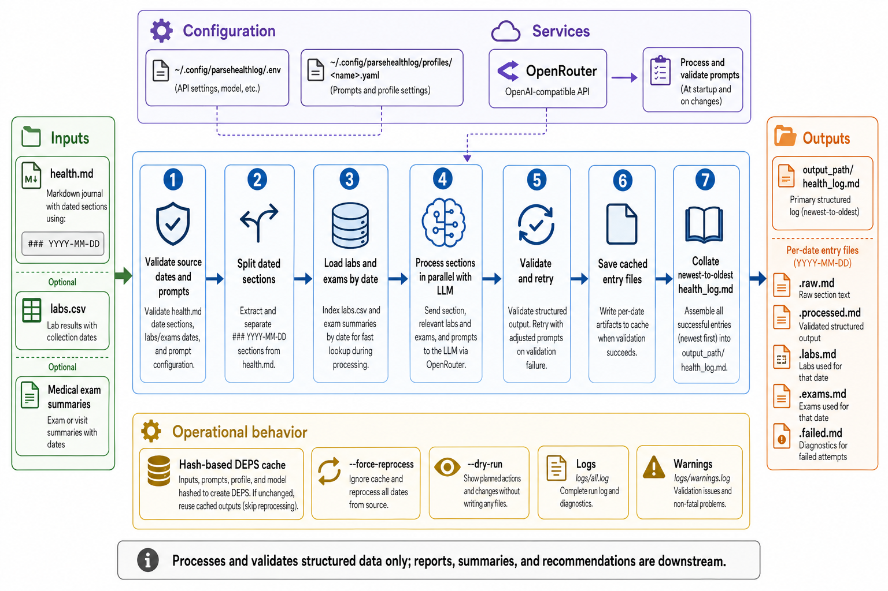

<div align="center">
  

  **📓 Transform health journal entries into structured, validated data 🏥**

  [GitHub](https://github.com/tsilva/parsehealthlog) · [Pipeline docs](docs/pipeline.md)
</div>

parsehealthlog is a Python CLI for turning a date-sectioned markdown health journal into structured markdown. It reads journal entries, optional lab CSVs, and optional medical exam summaries, then uses an OpenAI-compatible LLM endpoint to process and validate each date independently.

The primary output is `health_log.md`: one collated log, newest to oldest, with `Journal`, `Lab Results`, and `Medical Exams` sections when those sources are present.

## Install

Requires Python 3.10 or newer.

```bash
curl -LsSf https://astral.sh/uv/install.sh | sh
git clone https://github.com/tsilva/parsehealthlog.git
cd parsehealthlog
uv sync

mkdir -p ~/.config/parsehealthlog/profiles

cat > ~/.config/parsehealthlog/.env <<'ENV'
OPENROUTER_API_KEY=your-key
MODEL_ID=gpt-4o-mini
ENV

cat > ~/.config/parsehealthlog/profiles/myprofile.yaml <<'YAML'
health_log_path: /path/to/health.md
output_path: /path/to/output
base_url: https://openrouter.ai/api/v1
workers: 4
YAML

uv run parsehealthlog --profile myprofile
```

Open `/path/to/output/health_log.md`.

## Commands

```bash
uv run parsehealthlog --profile myprofile          # process one profile
uv run parsehealthlog --profile myprofile --dry-run # preview planned changes
uv run parsehealthlog --profile myprofile --force-reprocess # ignore cached outputs
uv run parsehealthlog --list-profiles              # list configured profiles
uv run pytest                                      # run tests
```

## Notes

- Source entries use `### YYYY-MM-DD` or `### YYYY/MM/DD` headings. Dates must be real, unique, and consistently ordered.
- Runtime config lives in `~/.config/parsehealthlog/.env`; profiles live in `~/.config/parsehealthlog/profiles/<name>.yaml`.
- `OPENROUTER_API_KEY` is required. `MODEL_ID` defaults to `gpt-4o-mini`, and `base_url` defaults to `https://openrouter.ai/api/v1`.
- Optional profile fields include `labs_parser_output_path`, `medical_exams_parser_output_path`, and `workers`.
- Output is written under `output_path`, with cached per-date artifacts in `output_path/entries/`.
- Caching is hash-based through `DEPS` comments; use `--force-reprocess` after prompt or source changes when you need a full rebuild.
- Logs are written to `logs/all.log` and `logs/warnings.log`.

## Architecture



## License

[MIT](LICENSE)
