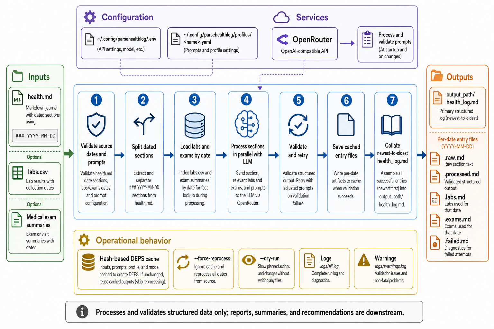

<p align="center">
  
  <br />
  <!-- repo-tagline:start -->
  <strong>📓 Transform health journal entries into structured, validated data 🏥</strong>
  <!-- repo-tagline:end -->
</p>

[GitHub](https://github.com/tsilva/parsehealthlog) · [Pipeline docs](docs/pipeline.md)

parsehealthlog is a Python CLI for turning a date-sectioned markdown health journal into structured markdown. It reads journal entries, optional lab CSVs, and optional medical exam summaries, then uses an OpenAI-compatible LLM endpoint to process and validate each date independently.

The primary output is `health_log.md`: one collated log, newest to oldest, with `Journal`, `Lab Results`, and `Medical Exams` sections when those sources are present.

## Install

Requires Python 3.10 or newer.

```bash
curl -LsSf https://astral.sh/uv/install.sh | sh
git clone https://github.com/tsilva/parsehealthlog.git
cd parsehealthlog
uv sync

mkdir -p ~/.config/parsehealthlog/profiles

cat > ~/.config/parsehealthlog/.env <<'ENV'
OPENROUTER_API_KEY=your-key
MODEL_ID=google/gemini-3.7-flash
ENV

cat > ~/.config/parsehealthlog/profiles/myprofile.yaml <<'YAML'
health_log_path: /path/to/health.md
output_path: /path/to/output
base_url: https://openrouter.ai/api/v1
workers: 4
YAML

uv run parsehealthlog --profile myprofile
```

Open `/path/to/output/health_log.md`.

## Commands

```bash
uv run parsehealthlog --profile myprofile          # process one profile
uv run parsehealthlog --profile myprofile --dry-run # preview planned changes
uv run parsehealthlog --profile myprofile --force-reprocess # ignore cached outputs
uv run parsehealthlog --list-profiles              # list configured profiles
uv run pytest                                      # run tests
```

## Notes

- Source entries use `### YYYY-MM-DD` or `### YYYY/MM/DD` headings. Dates must be real; repeated dates are merged in source order and the final timeline is sorted newest first.
- Runtime config lives in `~/.config/parsehealthlog/.env`; profiles live in `~/.config/parsehealthlog/profiles/<name>.yaml`.
- `OPENROUTER_API_KEY` is required. `MODEL_ID` defaults to `google/gemini-3.7-flash`, and `base_url` defaults to `https://openrouter.ai/api/v1`.
- Optional profile fields include `labs_parser_output_path`, `medical_exams_parser_output_path`, and `workers`.
- Output is written under `output_path`, with cached per-date artifacts in `output_path/entries/`.
- Caching is hash-based through `DEPS` comments; use `--force-reprocess` after prompt or source changes when you need a full rebuild.
- Logs are written to `logs/all.log` and `logs/warnings.log`.

## Architecture



## License

[MIT](LICENSE)

## Source fidelity

Repeated same-day sections are merged without losing content; source dates may be entered out of order, while the final log remains newest-first. Invalid date formats are still rejected. Lab CSVs are normalized independently before merging, and canonical values, units and reference ranges come from one schema. Detection-limit comparators remain attached to values. Changes only to lab/exam inserts reuse the journal text already validated against identical raw text and prompts. Orphaned lab/exam sidecars are removed when those dates disappear from their corresponding source.

The unified timeline retains an attributed verbatim copy of every journal body, in its original language, alongside successful English curation. If curation fails validation, the timeline keeps the source copy and evidence inserts; `.failed.md` records the curation failure and the run reports errors. Embedded clinical interpretations and historical dates must survive curation.

Exam summaries use their explicit `exam_date`; the directory date is a legacy fallback only. Explicitly undated summaries remain available in the exam corpus and are not assigned a journal date.
